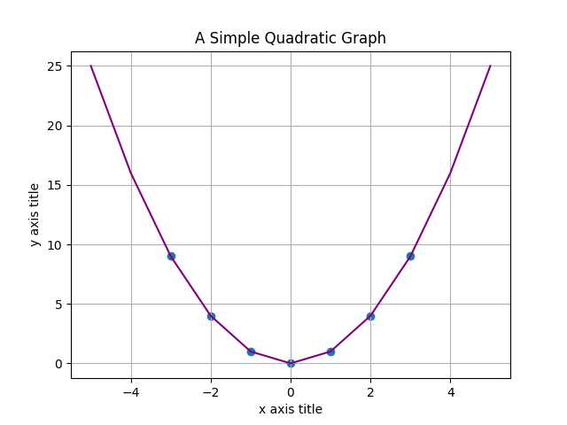

# Boson's setup information and README (Python Edition):

##### >> Created by Coded.ari on Discord

 

## Description

I created Boson as a means of replacing Excel in my A-Level Physics course as I hate using it despite somewhat having valid qualifications in using it, and being proficient in using Google Sheets which is technically just the same thing, but with cloud computing.

I realised that the project can be actively maintained and extended using generative AI and other means of technology to do more complex things than just be a complete dictionary full of constants and equations and for graphing data found in experiments / practicals.

## Installation & Setup

Firstly, as told by the title, it is entirely written in Python unlike its sibling version which is written in a mixture of both C AND Python, so either way you will need to install Python to your system.

Go to https://python.org/downloads and install the latest version which will be shown as below.

After you download Python to your system you will be greeted by this screen as shown below:

([I stole the image from google because mine just says update lmao](https://docs.python.org/3/_images/win_installer.png))

After this you need to install the differen Python libraries from the "requirements.txt" file.

In order to do this use the command "pip install -r requirements.txt" and it will install all of the additional libraries used that are listed in the requirements.txt file.

Since this is Python and not C, that is it, now enjoy your funny code for graphing data.

